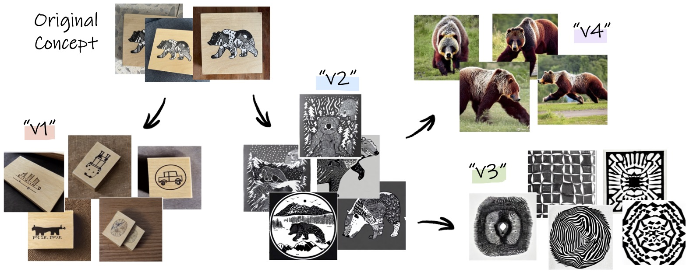
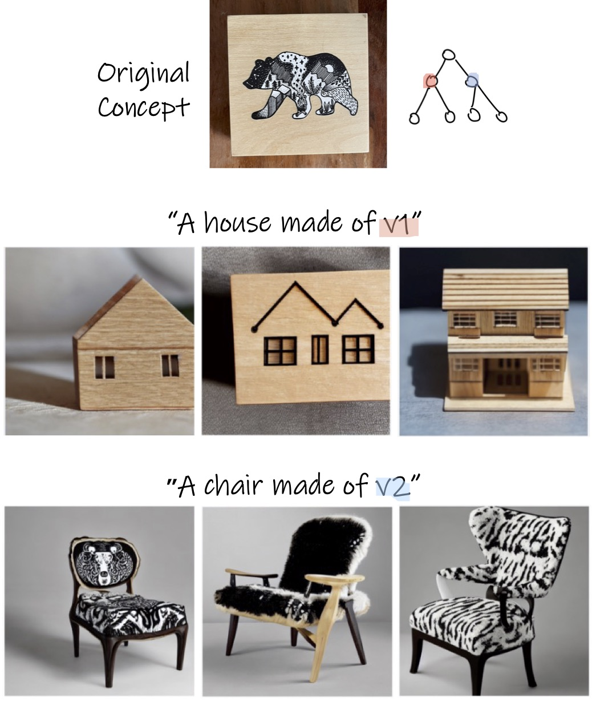

# Concept Decomposition for Visual Exploration and Inspiration

<a href="https://inspirationtree.github.io/inspirationtree/"></a>
<a href="https://arxiv.org/abs/2305.18203"></a>
<a href="https://www.apache.org/licenses/LICENSE-2.0.txt"></a>
<!-- Official implementation. -->
<br>


<p align="center">
  
  
> <a href="https://inspirationtree.github.io/inspirationtree/">**Concept Decomposition for Visual Exploration and Inspiration**</a>
>
> <a href="https://yael-vinker.github.io/website/">Yael Vinker</a>,
<a href="https://scholar.google.com/citations?user=imBjSgUAAAAJ&hl=ru">Andrey Voynov</a>,
<a href="https://danielcohenor.com/">Daniel Cohen-Or</a>,
<a href="https://faculty.runi.ac.il/arik/site/index.asp">Ariel Shamir</a>
> <br>
> Our method provides a tree-structured visual exploration space for a given unique concept. The nodes of the tree ("v_i") are newly learned textual vector embeddings, injected to the latent space of a pretrained text-to-image model. The nodes encode different aspects of the subject of interest. Through examining combinations within > and across trees, the different aspects can inspire the creation of new designs and concepts, as can be seen below.
</p>

# Setup
```
git clone https://github.com/yael-vinker/inspiration_tree.git
```

## Environment (with pip)
Our code relies on the enviornment in the official [Stable Diffusion repository](https://github.com/CompVis/stable-diffusion). To set up their environment, please run:
```
python -m venv .tree_venv
source .tree_venv/bin/activate
pip install -r requirements.txt
```
Technical details:
* CUDA 11.6
* torch 1.7.1+cu110

**Hugging Face Diffusers Library**  
Our code relies on the [diffusers](https://github.com/huggingface/diffusers) library and the official [Stable Diffusion v1.4](https://huggingface.co/CompVis/stable-diffusion-v1-4) model.

# Usage
<p align="center">
  
<br>
This code will allow you to generate a tree per concept, and play with the different prompts and combinations for the generated tree (under "inspiration_tree_playground.ipynb").
</p>


## Pretrained Models and Datasets
As part of our code release and to assist with comparisons, we have also provided some of the trained models and datasets used in the paper. 

All of our models (learned tokens from the paper) can be found undeer the "learned_tokens" directory. The notebook inspiration_tree_playground.ipynb shows how to load them and reproduce the results from the paper (under "Play with learned aspects from the paper"). 
All datasets used from Textual Inversion can be found under "datasets".

## Generate your tree
The logic for generating the tree is under "main_multiseed.py", which runs the framwork for a <b>single node</b>.
You can generate the tree by passing your own parameters to main_multiseed.py. An example is given in "run_decompose.sh":
```
python main_multiseed.py --parent_data_dir "cat_sculpture/" --node v0 --test_name "v0" --GPU_ID "${GPU_ID}" --multiprocess 0
```
Notes:
- The "test_name" should be identical to the chosen node
Results:
- The results will be saved to "outputs/<parent_data_dir>/<node>"
- In "final_samples.jpg" you can see a batch of random samples of the learned nodes
- Under "consistency_test" we save the results of the seed selection procedure
- Once training is finished, you can continue with splitting the generated nodes as well

## Inference
We made a notebook ("inspiration_tree_playground.ipynb") to play with the results, and this should be the most convenient option.
Notes: 
- The notebook shows the concepts learned in each node
- You can also load checkpoints from early iterations
- You can generate new concepts using natural language sentences

# Acknowledgements
Our code builds on the [diffusers implementation of textual inversion](https://github.com/huggingface/diffusers/tree/main/examples/textual_inversion) 

## Citation
If you find this useful for your research, please cite the following:
```bibtex
@article{vinker2023concept,
  title={Concept Decomposition for Visual Exploration and Inspiration},
  author={Yael Vinker and Andrey Voynov and Daniel Cohen-Or and Ariel Shamir},
  journal={arXiv preprint arXiv:2305.18203},
  year={2023}
}
```

## Disclaimer

This is not an officially supported Google product.
